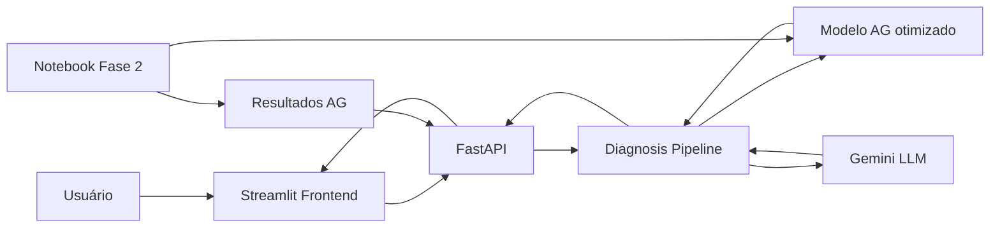

# 9IADT Fase 2 Tech Challenge

Sistema de suporte ao diagnóstico do câncer de mama usando Machine Learning, Algoritmos Genéticos e LLMs.

Repositório da Fase 2:
`git@github.com:fiap-postech-ia-para-devs-grupo/9IADT-fase-2-tech-challenge.git`

## Requisitos

| Ferramenta | Versão mínima | Instalação |
| :--- | :--- | :--- |
| Python | 3.11 | [python.org](https://www.python.org/downloads/) |
| uv | 0.4+ | `curl -LsSf https://astral.sh/uv/install.sh \| sh` |
| Node.js | 20+ | [nodejs.org](https://nodejs.org/) |

## Configuração do ambiente

```bash
# 1. Clone o repositório
git clone git@github.com:fiap-postech-ia-para-devs-grupo/9IADT-fase-2-tech-challenge.git
cd 9IADT-fase-2-tech-challenge

# 2. Copie o arquivo de variáveis de ambiente
cp .env.example .env
```

Edite o `.env` e preencha as chaves de API:

| Variável | Obrigatória | Descrição |
| :--- | :--- | :--- |
| `GEMINI_API_KEY` | Sim | Chave da API Gemini (Google AI Studio) |

```bash
# 3. Instale as dependências via uv
uv sync --frozen
```

## Como rodar

### Docker Compose (recomendado)

```bash
docker compose up --build
```

Isso sobe a API (`http://localhost:8000`) e o Streamlit (`http://localhost:8501`). O Compose aguarda o health check da API antes de iniciar a interface.

Para acompanhar os logs:

```bash
docker compose logs -f
```

Os logs registram rota, status e duração das requisições, sem incluir dados do paciente. A pasta `results/` é montada como volume local para preservar avaliações da LLM.

### Sem Docker

```bash
npm install
npm run dev
```

### Separadamente

#### API (FastAPI)

```bash
uv run uvicorn tech_challenge.adapters.api:app --reload --host 0.0.0.0 --port 8000
```

Acesse a documentação interativa (Swagger) em `http://localhost:8000/docs`.

##### Exemplos de uso da API

```bash
# Health check
curl http://localhost:8000/health
# {"status":"ok"}

# Metadados dos pacientes disponíveis no dataset
curl http://localhost:8000/patients/metadata
# {"count":569,"min_index":0,"max_index":568}

# Diagnóstico de um paciente pelo índice no dataset
curl -X POST http://localhost:8000/diagnose \
  -H "Content-Type: application/json" \
  -d '{"patient_index": 7}'
# {
#   "prediction": "MALIGNO",
#   "confidence": 0.88,
#   "top_features": [{"feature": "worst concave points", "value": 0.1556, "impact": 0.1267}, ...]
# }

# Explicação em linguagem natural (Gemini) a partir do resultado do diagnóstico
curl -X POST http://localhost:8000/explain \
  -H "Content-Type: application/json" \
  -d '{
    "prediction": "MALIGNO",
    "confidence": 0.88,
    "top_features": [{"feature": "worst concave points", "value": 0.1556, "impact": 0.1267}]
  }'
# {"explanation": "...", "disclaimer": "...", "details": {...}}

# Pergunta de acompanhamento sobre um diagnóstico já explicado
curl -X POST http://localhost:8000/chat \
  -H "Content-Type: application/json" \
  -d '{"question": "Quais features mais influenciaram esta predição?"}'
# {"answer": "...", "details": {...}}

# Resultados consolidados do estudo do Algoritmo Genético
curl http://localhost:8000/ag-results
# {"schema_version": 2, "experiments": [...], "best_experiment": "Exp3_Mutacao_Maior", ...}
```

`/diagnose` retorna `400` com `{"detail": "<motivo>"}` quando `patient_index` está fora do intervalo do dataset de teste (consulte `/patients/metadata` para saber o intervalo válido).

#### Interface (Streamlit)

Requer a API rodando em paralelo.

```bash
uv run streamlit run src/tech_challenge/presentation/streamlit_app.py
```

Acesse `http://localhost:8501`.

### Notebook da Fase 2

```bash
uv run jupyter notebook
```

| Notebook | Descrição |
| :--- | :--- |
| `notebooks/tech_challenge_fase2.ipynb` | Desenvolvimento da Fase 2: Algoritmos Genéticos, integração LLM e pipeline completo |

## Devcontainer (VS Code)

Abra o repositório no VS Code e aceite a sugestão de **Reopen in Container**. O ambiente é configurado automaticamente via `.devcontainer/`.

## Arquitetura macro



## Estrutura do projeto

```text
├── src/tech_challenge/          # Código runtime do projeto
│   ├── adapters/                # Adaptadores FastAPI
│   ├── presentation/            # Interface Streamlit
│   ├── llm/                     # Prompts e adaptador Gemini
│   ├── diagnosis.py             # Módulo de diagnóstico
│   ├── explanation.py           # Módulo de explicação
│   └── experiments.py           # Resultados de experimentos para apresentação
├── notebooks/                   # Notebook principal da Fase 2
├── data/                        # Dataset Wisconsin Breast Cancer
├── model/                       # Melhor modelo otimizado pelo AG (.pkl)
└── results/                     # Resultado consolidado dos experimentos do AG
```

## Atualização dos resultados do AG

A tela de resultados do Algoritmo Genético consome `results/ag_experiment_results.json`. O notebook exporta esse arquivo e `model/best_model.pkl` automaticamente ao executar o estudo.

Quando os experimentos forem alterados, execute novamente o notebook. A API e o Streamlit apenas carregam o artefato; eles não reimplementam nem transcrevem os resultados do AG.

## Protocolo experimental

O AG otimiza exclusivamente hiperparâmetros do Random Forest. O vencedor é escolhido pelo fitness `0.6 × F1 + 0.4 × recall` em validação cruzada estratificada. O conjunto de teste é usado somente depois da seleção para comparar o RF padrão com o RF otimizado.

As contribuições mostradas na análise de pacientes são valores SHAP locais do modelo salvo. A explicação da LLM e o gráfico usam a mesma fonte de impactos.
