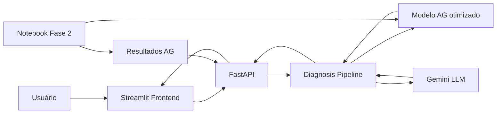

# 9IADT Fase 2 Tech Challenge

Sistema de suporte ao diagnóstico do câncer de mama usando Machine Learning, Algoritmos Genéticos e LLMs.

Repositório da Fase 2:
`git@github.com:fiap-postech-ia-para-devs-grupo/9IADT-fase-2-tech-challenge.git`

## Requisitos

| Ferramenta | Versão mínima | Instalação |
| :--- | :--- | :--- |
| Python | 3.11 | [python.org](https://www.python.org/downloads/) |
| uv | 0.4+ | `curl -LsSf https://astral.sh/uv/install.sh \| sh` |
| Node.js | 20+ | [nodejs.org](https://nodejs.org/) |

## Configuração do ambiente

```bash
# 1. Clone o repositório
git clone git@github.com:fiap-postech-ia-para-devs-grupo/9IADT-fase-2-tech-challenge.git
cd 9IADT-fase-2-tech-challenge

# 2. Copie o arquivo de variáveis de ambiente
cp .env.example .env
```

Edite o `.env` e preencha as chaves de API:

| Variável | Obrigatória | Descrição |
| :--- | :--- | :--- |
| `GEMINI_API_KEY` | Sim | Chave da API Gemini (Google AI Studio) |

```bash
# 3. Instale as dependências via uv
uv sync --frozen
```

## Como rodar

### API + Interface juntos (recomendado)

```bash
npm install
npm run dev
```

Isso sobe a API (`http://localhost:8000`) e o Streamlit (`http://localhost:8501`) em paralelo.

### Separadamente

#### API (FastAPI)

```bash
uv run uvicorn tech_challenge.adapters.api:app --reload --host 0.0.0.0 --port 8000
```

Acesse a documentação em `http://localhost:8000/docs`.

#### Interface (Streamlit)

Requer a API rodando em paralelo.

```bash
uv run streamlit run src/tech_challenge/presentation/streamlit_app.py
```

Acesse `http://localhost:8501`.

### Notebook da Fase 2

```bash
uv run jupyter notebook
```

| Notebook | Descrição |
| :--- | :--- |
| `notebooks/tech_challenge_fase2.ipynb` | Desenvolvimento da Fase 2: Algoritmos Genéticos, integração LLM e pipeline completo |

## Devcontainer (VS Code)

Abra o repositório no VS Code e aceite a sugestão de **Reopen in Container**. O ambiente é configurado automaticamente via `.devcontainer/`.

## Arquitetura macro



## Estrutura do projeto

```text
├── src/tech_challenge/          # Código runtime do projeto
│   ├── adapters/                # Adaptadores FastAPI
│   ├── presentation/            # Interface Streamlit
│   ├── llm/                     # Prompts e adaptador Gemini
│   ├── diagnosis.py             # Módulo de diagnóstico
│   ├── explanation.py           # Módulo de explicação
│   └── experiments.py           # Resultados de experimentos para apresentação
├── notebooks/                   # Notebook principal da Fase 2
├── data/                        # Dataset Wisconsin Breast Cancer
├── model/                       # Melhor modelo otimizado pelo AG (.pkl)
└── results/                     # Resultado consolidado dos experimentos do AG
```

## Atualização dos resultados do AG

A tela de resultados do Algoritmo Genético consome `results/ag_experiment_results.json`. Esse arquivo é um artefato congelado das saídas executadas em `notebooks/tech_challenge_fase2.ipynb`, principalmente as seções de execução dos experimentos, comparação e persistência do melhor modelo.

Quando os experimentos forem alterados, execute novamente o notebook e atualize `results/ag_experiment_results.json` com os novos valores finais. A API e o Streamlit apenas carregam esse artefato; eles não reimplementam o motor do AG.

## Referência da Fase 1

A Fase 1 é usada apenas como referência comparativa para a Fase 2. O resultado base citado no comparativo do AG é: acurácia `0.9649`, precisão `0.9750`, recall `0.9286`, F1 `0.9512`, ROC AUC `0.9960` e equity gap `0.0750`.

O código exploratório, notebook e artefatos intermediários da Fase 1 não fazem parte deste repositório, que permanece focado na entrega da Fase 2.
